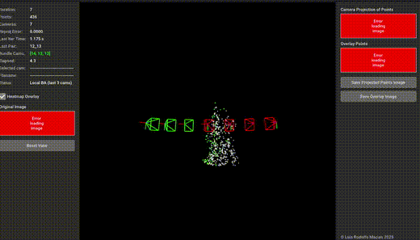
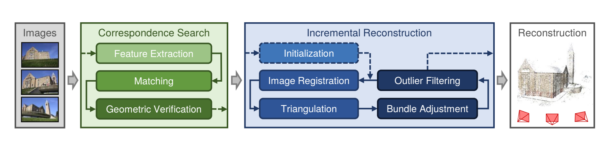

# Structure-from-Motion (SfM) Pipeline

This repository demonstrates a 3D reconstruction pipeline using Structure-from-Motion techniques in Python with opencv library. The implementation uses a coarse to fine approach and also includes a GUI visualizer to see on live the reconstruction.

If you really want to dive into the math of the pipeline that was developed, I reccomend you checking Structure from Motion lecture from Tuebingen University [here](https://uni-tuebingen.de/fakultaeten/mathematisch-naturwissenschaftliche-fakultaet/fachbereiche/informatik/lehrstuehle/autonomous-vision/lectures/computer-vision/)

To see more information about the pipeline [here](https://luisrodolfo10.github.io/incremental_sfm/)

The datasets used in this project are from Tohoku University, you can check them out [here] (https://www.aoki.ecei.tohoku.ac.jp/mvs/)