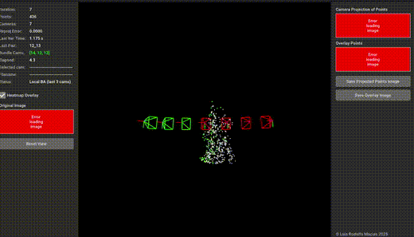
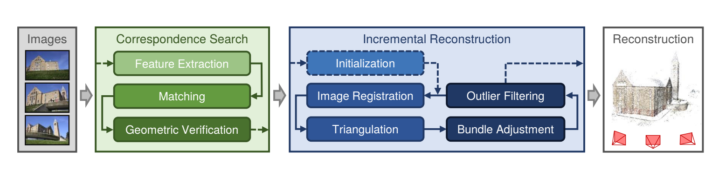
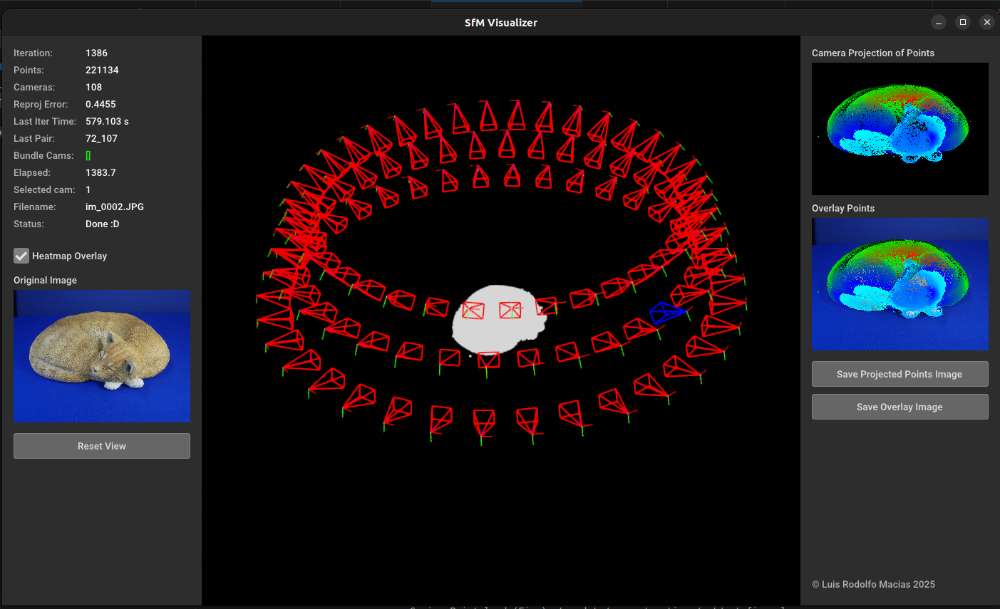

# Structure-from-Motion (SfM) Pipeline

Welcome to the SfM Pipeline project! This repository demonstrates a 3D reconstruction pipeline using Structure-from-Motion techniques. Below, we describe the entire pipeline, including the key modules and their roles in building a 3D model from images.



If you really want to dive into the math of the pipeline that was developed, I reccomend you checking Structure from Motion lecture from Tuebingen University [here](https://uni-tuebingen.de/fakultaeten/mathematisch-naturwissenschaftliche-fakultaet/fachbereiche/informatik/lehrstuehle/autonomous-vision/lectures/computer-vision/)



---

## 1. Extracting and Matching Keypoints

The first step in the pipeline is to extract keypoints (features) from the input images and match them across image pairs. This is a critical step because the quality of the matches directly affects the accuracy of the reconstruction.

### Keypoint Extraction
The projects use feature detectors like **SIFT** or **ORB** to extract keypoints from images. These keypoints represent distinctive regions in the image, such as corners or blobs, that are invariant to scale, rotation, and illumination changes.

### Keypoint Matching
Once the keypoints are extracted, we match them between image pairs using a descriptor matcher (e.g., FLANN or brute-force matcher). This step identifies corresponding points in the images.

### Why Geometric Verification?
Keypoint matching often produces outliers due to repetitive patterns or noise. To filter out incorrect matches, we use **geometric verification** with techniques like the **Fundamental Matrix** estimation. This ensures that only matches consistent with the epipolar geometry are retained.

**Example Code Snippet**:
```python
# Extract keypoints and descriptors
kp1, des1 = feature_extractor.detectAndCompute(img1, None)
kp2, des2 = feature_extractor.detectAndCompute(img2, None)

# Match descriptors
matches = matcher.knnMatch(des1, des2, k=2)

# Apply ratio test for filtering
good_matches = [m for m, n in matches if m.distance < 0.75 * n.distance]

# Geometric verification using RANSAC
pts1 = np.float32([kp1[m.queryIdx].pt for m in good_matches])
pts2 = np.float32([kp2[m.trainIdx].pt for m in good_matches])
F, mask = cv2.findFundamentalMat(pts1, pts2, cv2.FM_RANSAC)
inliers = [m for i, m in enumerate(good_matches) if mask[i]]
```

---

## 2. Two-View SfM

After matching keypoints, the next step is to estimate the relative pose (rotation and translation) between two images and triangulate 3D points.

### Essential Matrix Estimation
The **Essential Matrix** is computed from the inlier matches. It encodes the relative rotation and translation between the two cameras.

### Triangulation
Using the relative pose and the inlier matches, we triangulate 3D points. These points form the initial sparse 3D reconstruction.

**Example Code Snippet**:
```python
# Estimate Essential Matrix
E, mask = cv2.findEssentialMat(pts1, pts2, K, method=cv2.RANSAC, threshold=1.0)

# Recover pose
_, R, t, mask_pose = cv2.recoverPose(E, pts1, pts2, K)

# Triangulate points
proj1 = np.dot(K, np.hstack((np.eye(3), np.zeros((3, 1)))))
proj2 = np.dot(K, np.hstack((R, t)))
points_4d = cv2.triangulatePoints(proj1, proj2, pts1.T, pts2.T)
points_3d = points_4d[:3] / points_4d[3]
```

---

## 3. Incremental SfM Pipeline

The incremental SfM pipeline builds on the two-view reconstruction by adding one image at a time and refining the 3D model.

### Adding New Images
For each new image, we match its keypoints to the existing 3D points and estimate its pose relative to the current reconstruction.

### Triangulating New Points
After adding the new image, we triangulate additional 3D points using matches between the new image and the existing images.

### Local Bundle Adjustment
To refine the reconstruction, we perform **local bundle adjustment** on the most recently added cameras. This optimizes the camera poses and 3D points to minimize reprojection error.

**Example Code Snippet**:
```python
# Add new image to reconstruction
reconstruction.add_image(new_image, matches)

# Triangulate new points
reconstruction.triangulate_new_points()

# Perform local bundle adjustment
local_bundle_adjustment(reconstruction, K, local_cam_idxs=recent_cams)
```

---

## 4. Bundle Adjustment

Bundle adjustment is a key optimization step in SfM. It refines the entire reconstruction by minimizing the reprojection error across all cameras and 3D points.

### What is Bundle Adjustment?
Bundle adjustment adjusts the camera parameters (intrinsics and extrinsics) and the 3D point coordinates to achieve the best fit between the observed and projected points.

The project uses a vectorized projection error to optimize the BA process and also with an implementation of a fast jacobian sparsity computation.

### Local vs. Global Bundle Adjustment
- **Local Bundle Adjustment**: Optimizes only the most recently added cameras and points.
- **Global Bundle Adjustment**: Optimizes the entire reconstruction. This is computationally expensive and is performed less frequently.

**Example Code Snippet**:
```python
# Local bundle adjustment
res = local_bundle_adjustment(reconstruction, K, local_cam_idxs=local_cams)

# Global bundle adjustment
if len(used_images) % GLOBAL_BA_EVERY == 0:
    global_bundle_adjustment(reconstruction, K)
```

---

## 5. Full SfM Script

The full SfM script orchestrates all the above modules to produce a complete 3D reconstruction. It starts with two-view SfM, incrementally adds images, and refines the reconstruction with bundle adjustment.

This script also comes with an optional Coarse to Fine implementation to speed up the SfM process, basically choosing N points for each trinagulation of matches and performing the full SfM pipeline with this N points to get the camera poses based on this coarse reconstruction. And at the end it will triangulate everything (A fine reconstruction)

### Pipeline Overview
1. Extract and match keypoints.
2. Perform two-view SfM to initialize the reconstruction.
3. Incrementally add images and triangulate new points.
4. Refine the reconstruction with local and global bundle adjustment.

### Visualization
The script also includes a visualization module to display the 3D points and camera poses during the reconstruction process.

**Example Code Snippet**:
```python
# Main SfM pipeline
for next_img in image_sequence:
    success = add_image_to_reconstruction(next_img)
    if success:
        triangulate_new_points()
        if len(used_images) >= BUNDLE_N_CAMS:
            local_bundle_adjustment()
        if len(used_images) % GLOBAL_BA_EVERY == 0:
            global_bundle_adjustment()
```

---

## Results

Below is an example of a 3D reconstruction produced by the pipeline:



---

## Explore the Code

Check out the [GitHub repository](https://github.com/luisrodolfo10/incremental_sfm) for the full implementation of the SfM pipeline.
